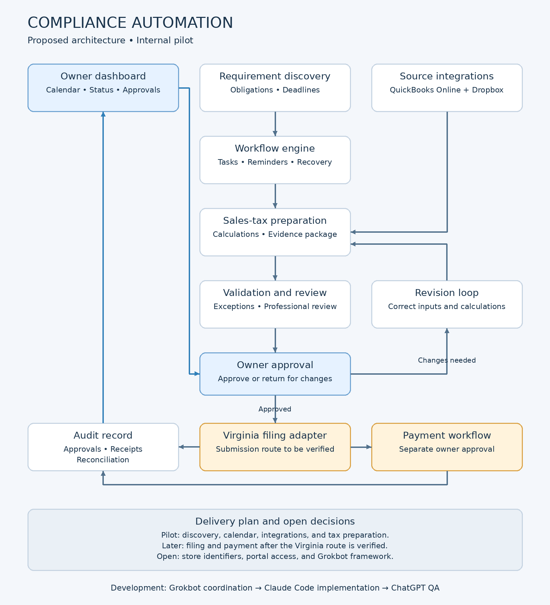

# Project Complied

Owner-approved compliance workflow automation. Initial pilot: requirement discovery, calendar, QuickBooks Online, Dropbox, and Virginia monthly sales-tax preparation.

## Specifications

- [Product requirements](docs/specs/01-PRD.md)
- [Technical requirements](docs/specs/02-Technical-Requirements.md)
- [Architecture](docs/specs/03-System-Architecture.md)
- [Delivery roadmap](docs/ROADMAP.md)



## Current implementation

Repository foundation and a dependency-free Python approval-control prototype. This is not a running tax application. Python is a provisional reference implementation, not a final technology selection. No live integrations, tax rules, filing, or payments are enabled.

```sh
python3 -m unittest discover -s tests -v
python3 scripts/check_repository.py
```

CI checks the repository and approval tests. CodeQL analyzes Python. Gitleaks scans commit history. Dependabot opens weekly action-update PRs. Bot updates require human review; no automatic approvals or merges.

## Security

See [SECURITY.md](SECURITY.md), [threat model](docs/security/THREAT-MODEL.md), and [GitHub settings](docs/security/GITHUB-SETTINGS.md). This public repository holds synthetic fixtures and source code only. Never commit business records, credentials, tax returns, or payment details.

Specs are reconstructed drafts dated 3 October 2026. Virginia submission capabilities and store mappings remain unverified.
