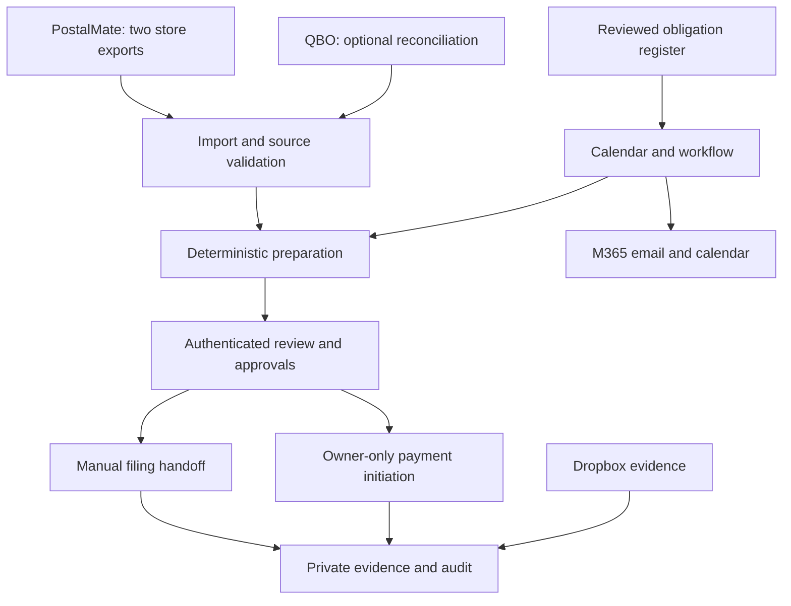

# Project Complied — System Architecture

Version: 0.4 | Updated: 5 October 2026 | Status: Implementation design; stack not selected

## Approach

Modular internal application with relational persistence, private evidence storage and a durable worker. Choose stack/hosting through an ADR before dependency changes; existing Python is only an approval reference. No Grokbot/Claude framework is selected or required.

## Current proposed topology

The earlier solution.png is a historical draft; this topology supersedes its QBO-first assumptions. No live account connection or external execution exists.

## Boundaries and components

| Component | Responsibility |
|---|---|
| Dashboard/API | Identity, server permissions, upcoming/overdue/unresolved tasks, review and receipts |
| Register/scheduler | Source-backed applicability, reviewed date rules, period tasks, timezone and recurrence |
| Import/preparation | PostalMate store completeness, snapshot hashes, decimal totals, mappings and discrepancy gates |
| Worker/outbox | Durable reminder attempts, event IDs, deduplication, failure/reconciliation queues |
| Approval/operations | Immutable package scope, stale/revoked denial, separate approval purposes and transaction-safe ledger |
| Evidence/audit | Private reports, hashes, versions, receipts, seven-year policy, append-only history |

Entities, locations, activities, jurisdictions, registrations, obligation versions, tasks, source snapshots, category mappings, rule versions, packages, exceptions, approvals, operations, notification attempts, receipts and audit events persist independently. QBO store differentiation is unnecessary for the initial import path; PostalMate provides location identity.

## Execution and safety

Owner-reviewed obligations create scoped tasks. Both store exports validate before entity aggregation. Preparation produces source-linked immutable packages; changes invalidate approvals. Authorized owner/delegate approves filing; manual submission attaches receipt and acceptance evidence. Payment approval is separate and defaults to owner-only; initiation is always owner-only. Unknown outcomes require reconciliation instead of blind retries.

Private evidence and secrets never enter public Git or CI. Separate worker permissions from API; connectors limited to authorized scope. Application OAuth permissions must be checked during implementation; do not claim provider scopes are read-only. Seven-year retention and backup/restore policy need explicit triggers and holds.

## Delivery boundaries

Calendar and synthetic imports can proceed now. Live M365/Dropbox/QBO access, verified tax calculations and portal operations require their own input/authorization gates. Portal API existence is unverified; manual filing is first. Google, automatic submission/payment and commercial tenancy are later work. See [roadmap](../ROADMAP.md) and [handoff](../../Handoff.md).
